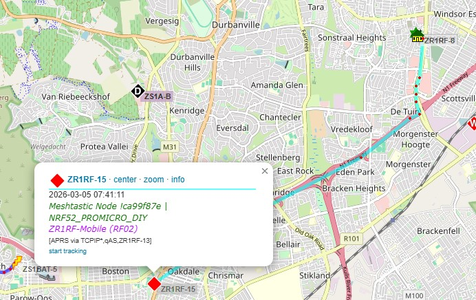

# mesh2aprs
Publish Meshtastic node positions to APRS‑IS



## Overview
**mesh2aprs** is a lightweight Python service that subscribes to Meshtastic MQTT telemetry and publishes position reports to the APRS‑IS network.  
This enables Meshtastic nodes to appear on APRS map services such as *aprs.fi* using their assigned callsigns.

---

## Features
- 🔄 Real‑time Meshtastic → APRS‑IS position forwarding  
- 📡 APRS‑IS login, filtering, and callsign mapping  
- 🌍 Region‑specific Meshtastic MQTT topic support  
- 🗂️ Flexible node-to-callsign configuration  
- 🧩 Minimal Python dependencies and simple deployment  

---

## Installation

```bash
git clone https://github.com/dadecoza/mesh2aprs.git
cd mesh2aprs
python3 -m venv venv
source venv/bin/activate
pip3 install -r requirements.txt
```

---

## Configuration

Edit the configuration file:

```bash
nano config.json
```

Below is a complete example configuration file:

### Example `config.json`

```json
{
    "mqtt": {
        "host": "mqtt.meshtastic.org",
        "port": 1883,
        "username": "meshdev",
        "password": "large4cats",
        "topic": "msh/ZA/#"
    },
    "meshtastic": {
        "key": "1PG7OiApB1nwvP+rz05pAQ=="
    },
    "aprs": {
        "callsign": "N0CALL-14",
        "host": "rotate.aprs2.net",
        "port": 14580,
        "filter": "filter a/-21.0/16.45/-35.5/33.5"
    },
    "nodes": {
        "c0c31644": {
            "callsign": "N0CALL-1"
        },
        "5becd72f": {
            "callsign": "N0CALL-2"
        },
        "9e7673f0": {
            "callsign": "N0CALL-3"
        },
        "d29538f9": {
            "callsign": "N0CALL-4"
        }
    },
    "update_interval": 10
}
```

---

## Configuration Reference

### MQTT Settings
| Field | Description |
|-------|-------------|
| `host` | MQTT broker address (public Meshtastic broker shown above) |
| `port` | MQTT port (default: 1883) |
| `username` / `password` | Optional credentials |
| `topic` | Region‑specific Meshtastic topic such as `msh/ZA/#`, `msh/EU_868/#`, `msh/US_915/#` |

---

### Meshtastic Section
| Field | Description |
|-------|-------------|
| `key` | Base64‑encoded Meshtastic decryption key used to decode MQTT frames |

---

### APRS Settings
| Field | Description |
|-------|-------------|
| `callsign` | Your APRS callsign with SSID (used to authenticate to APRS‑IS) |
| `host` | APRS‑IS server (use `rotate.aprs2.net` for redundancy) |
| `port` | APRS‑IS port (typically 14580) |
| `filter` | APRS‑IS filter to limit inbound traffic (typically a bounding box) |

Example southern Africa filter:
```
filter a/-21.0/16.45/-35.5/33.5
```

---

### Node Mapping
Each Meshtastic node ID is mapped to an APRS callsign:

```json
"nodes": {
    "c0c31644": { "callsign": "N0CALL-1", "symbol": "/>" }
}
```

- **Key** — Meshtastic node ID (hex string)  
- **Value**
  - APRS callsign
  - APRS Symbol (https://www.aprs.org/symbols/symbols-new.txt)   

Only listed nodes will be published.

---

### Update Interval

Sets how often each node is transmitted in seconds:

```
"update_interval": 10
```

---

## Running the Script

```bash
python3 main.py
```

---

## Notes
- You must have a valid APRS callsign + SSID to send to APRS‑IS.  
- Meshtastic nodes must output valid GPS data.  
- The APRS filter should cover your expected operating region.  
- Using `rotate.aprs2.net` ensures automatic APRS‑IS load balancing.  

---

## License
MIT License

---

## Contributions
Pull requests are welcome! If you have improvements, open an issue or PR.
